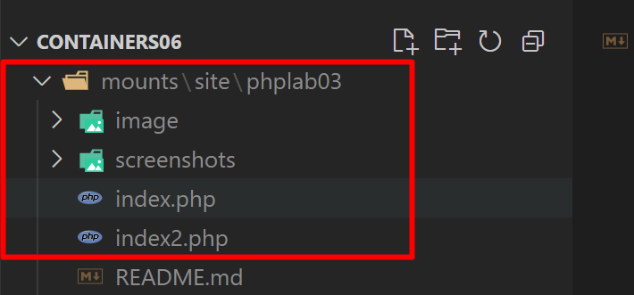
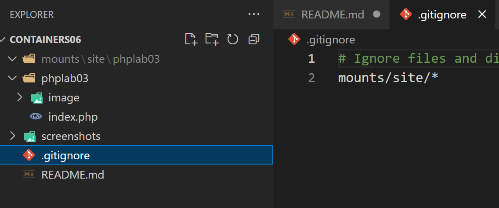
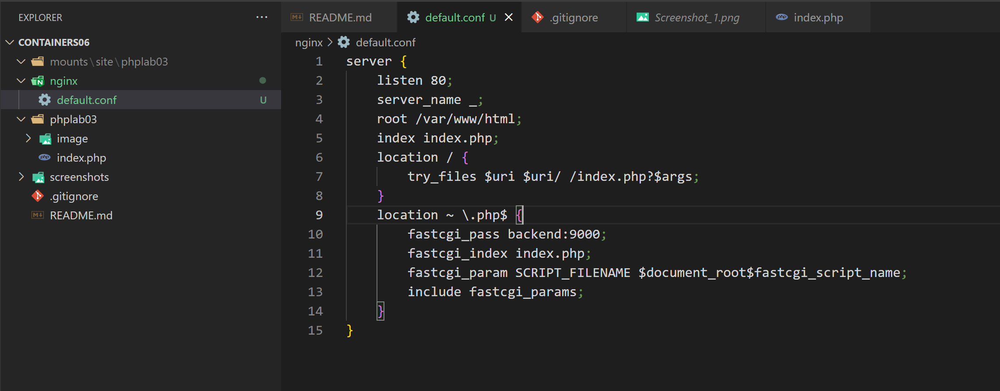
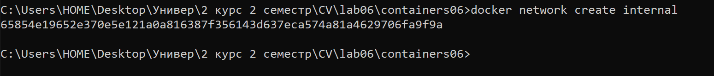
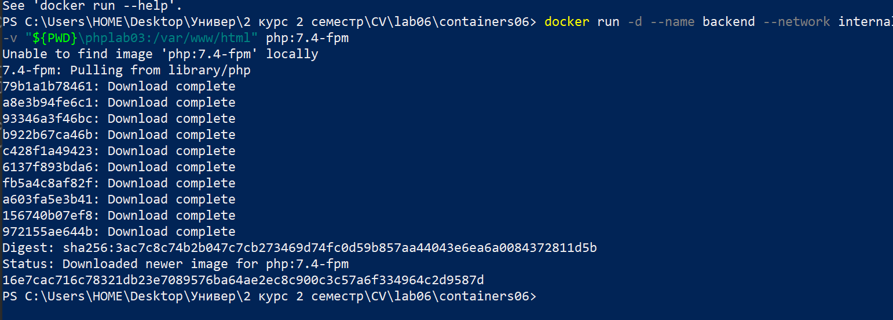
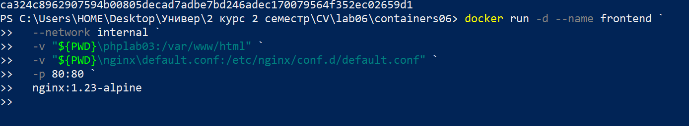
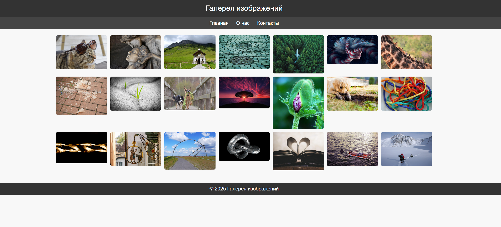

# Лабораторная работа №6. Взаимодействие контейнеров

## Студент
**Gachayev Dmitrii I2302**  
**Выполнено 09.04.2025**  

## Цель работы
Научиться управлять взаимодействием нескольких контейнеров.
## Задание
Создать php приложение на базе двух контейнеров: nginx, php-fpm.
# Выполнение
1. Создаю директорию `mounts/site` и переношу туда папку `phplab03` с сайтом с предмета php. 



2. Создаю `.gitignore` и вношу туда 

```bash
# Ignore files and directories
mounts/site/*
```



3. Создаю в директории `containers06` файл `nginx/default.conf` со следующим содержимым:

```bash
server {
    listen 80;
    server_name _;
    root /var/www/html;
    index index.php;
    location / {
        try_files $uri $uri/ /index.php?$args;
    }
    location ~ \.php$ {
        fastcgi_pass backend:9000;
        fastcgi_index index.php;
        fastcgi_param SCRIPT_FILENAME $document_root$fastcgi_script_name;
        include fastcgi_params;
    }
}
```



# Запуск и тестирование

1. Создаю сеть `internal` для контейнеров:

```bash
docker network create internal
```



Решил сменить `cmd` на `PowerShell` так как он современнее и более универсален

2. Создаю контейнер `backend` со следующими свойствами:

- на базе образа `php:7.4-fpm`;
- к контейнеру примонтирована директория `mounts/site` в `/var/www/html`;
- работает в сети `internal`

```bash
docker run -d --name backend --network internal -v "${PWD}\phplab03:/var/www/html" php:7.4-fpm
```



- `--name backend` - задаёт имя контейнера backend
- `--network internal` - подключает контейнер к Docker-сети с именем `internal`. Позволяет контейнерам взаимодействовать между собой по имени.
- `-v "${PWD}\phplab03:/var/www/html"` - создаёт монтирование, связывает локальную папку `phplab03` с папкой внутри контейнера `/var/www/html`. Это позволяет `PHP-контейнеру` видеть и исполнять `.php-файлы`.
`${PWD}` — текущая директория в `PowerShell`.
- `php:7.4-fpm` - образ, на основе которого запускается контейнер.

3. Создаю контейнер `frontend` со следующими свойствами:

- на базе образа `nginx:1.23-alpine`;
- с примонтированной директорией `mounts/site` в `/var/www/html`;
- с примонтированным файлом `nginx/default.conf` в `/etc/nginx/conf.d/default.conf`;
- порт 80 контейнера проброшен на порт `80` хоста;
- работает в сети `internal`.

```bash
docker run -d --name frontend `
  --network internal `
  -v "${PWD}\phplab03:/var/www/html" `
  -v "${PWD}\nginx\default.conf:/etc/nginx/conf.d/default.conf" `
  -p 80:80 `
  nginx:1.23-alpine
```



- `--network internal` - подключает контейнер к созданной ранее сети с именем `internal`. Это позволяет frontend-контейнеру общаться с backend-контейнером
- `-v "${PWD}\phplab03:/var/www/html"` - монтирует локальную папку `phplab03` в папку `/var/www/html` внутри контейнера
- `-v "${PWD}\nginx\default.conf:/etc/nginx/conf.d/default.conf"` - монтирует файл конфигурации nginx (мой default.conf) в нужную директорию внутри контейнера.
- `-p 80:80` - пробрасывает порт - внешний порт 80 на хосте - внутренний порт 80 в контейнере.
- `nginx:1.23-alpine` - указывает, на каком образе будет запущен контейнер

4. Перехожу на `http://localhost/` и вижу свой `index.php` с лабораторной по `AWD`. Все работает! 



# Контрольные вопросы

1. Каким образом в данном примере контейнеры могут взаимодействовать друг с другом?

Контейнеры подключены к одной пользовательской сети `internal`, созданной через Docker. Эта сеть позволяет им напрямую обмениваться данными, минуя хост-систему. Они работают как устройства в одной локальной сети.

2. Как видят контейнеры друг друга в рамках сети internal?

Внутри сети `internal` каждый контейнер доступен другому. Они обращаются друг к другу по имени контейнера (например `backend`)

3. Почему необходимо было переопределять конфигурацию nginx?

Стандартная конфигурация `nginx` не знает, что нужно обрабатывать .php-файлы и отправлять их на backend.
Переопределение `default.conf` позволяет:

- задать корневую папку `/var/www/html`
- настроить обработку PHP-файлов
- подключить backend как PHP-интерпретатор.

## Вывод
В ходе выполнения задания была создана внутренняя Docker-сеть internal, обеспечивающая взаимодействие между двумя контейнерами: backend на базе php:7.4-fpm и frontend на базе nginx:1.23-alpine. Папка с сайтом была примонтирована в оба контейнера, а конфигурация nginx переопределена для корректной обработки PHP-файлов. Контейнеры успешно взаимодействуют друг с другом по имени внутри сети, а сайт доступен по адресу http://localhost, что подтверждает правильную настройку окружения.